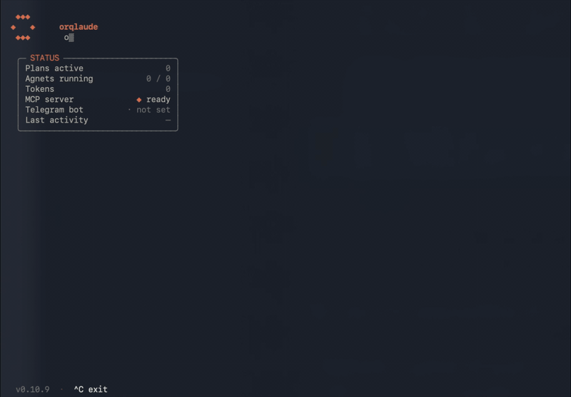

# @bnecko/orqlaude

Multi-agent orchestrator for Claude Code. One primary Claude session decomposes a complex task into N parallel **Agnets** (orqlaude's name for spawned workers), gets a single user approval, then dispatches each Agnet (in its own session and worktree) via the Claude Desktop app's native `mcp__ccd_session__spawn_task`. Tracks cost/tokens via JSONL tails, brokers messages between Agnets, detects hallucination, manages PRs, streams updates to your Telegram, and can spawn a reviewer Agnet per PR at the end.

The name is **orq**hestrator + **Claude**.



> Status: **v0.12.1** — 35+ tools, 236 tests passing, CI green. Live HTML dashboard (`orql web` — keyboard shortcuts, click-to-copy, SSE w/ heartbeat + CSP), cost analytics with sparklines (`orql cost`), goal quickstart wizard (`orql goal new`), token-first budgets (Max-friendly), self-registering child agents, hallucination detection, file-claim broker, durable memory + backlog, autopilot daemon, audit log, resumability, auto-review pipeline, and a **Telegram bot** for fleet notifications + remote control.

## Why orqlaude exists

A single Claude agent is great at focused work but slow at multi-region refactors. You can manually spawn parallel sessions via `spawn_task`, but you lose budget oversight, cross-agent coordination, and a single place to see "what's the fleet doing right now?"

orqlaude is the thin layer that adds those things. It never spawns processes itself — the Desktop app's `spawn_task` does that — but it owns the *plan*, the *budget*, the *broker*, and the *aggregation*.

## How it fits together

```
                          ┌──────────────────────┐
                          │   PRIMARY CLAUDE     │
                          └─────────┬────────────┘
   ┌─── orqlaude.create_plan ──────►│
   │   orqlaude.request_approval ──►│  (relays via AskUserQuestion)
   │   orqlaude.confirm        ────►│
   │   orqlaude.next_task      ────►│
   │   ccd_session.spawn_task  ────►├─── chip ─► ┌──────────┐
   │                                │            │ child #1 │ ─► auto-registers via checkin
   │                                │            │ session  │
   │   orqlaude.next_task      ────►│            └────┬─────┘
   │   ccd_session.spawn_task  ────►├─── chip ─►      │
   │                                │            ┌────▼─────┐
   │                                │            │ child #2 │
   │   orqlaude.status         ────►│ ◄────── claim_files, post_note
   │   orqlaude.poll_notes     ────►│ ◄────── PR url via post_note
   │   orqlaude.send_message   ────►│
   │   orqlaude.collect        ────►│
   │   orqlaude.review_prs     ────►├─── chip ─► reviewer #1
   │                                ├─── chip ─► reviewer #2
   └────────────────────────────────┘
```

## Install

```sh
npm install -g @bnecko/orqlaude   # CLI + MCP server
```

Then wire it into Claude Desktop's MCP config in one command:

```sh
cd /path/to/your/project
orql setup
```

`orql setup` **patches** Claude Desktop's `claude_desktop_config.json` in place — adds an `orqlaude` MCP server entry pointed at this project's state dir, and **preserves every other server you have configured** (lm-studio, etc.) plus the entire `preferences` block. Writes a timestamped `.bak` before changing anything. Re-runs are idempotent — if the entry is already correct, it reports `already correct; nothing to do` and exits without touching the file.

Flags:
- `--state-dir <path>` override the default (which walks up from cwd for a `.git`)
- `--config-path <path>` override Claude Desktop's config path
- `--yes` skip prompts

Fully quit and relaunch Claude Desktop after running. The `mcp__orqlaude__*` tools will then appear in your sessions.

If you'd rather edit the config yourself, the entry should look like:

```json
{
  "mcpServers": {
    "orqlaude": {
      "command": "npx",
      "args": ["-y", "-p", "@bnecko/orqlaude", "orqlaude-mcp"],
      "env": {
        "ORQLAUDE_STATE_DIR": "/absolute/path/to/your/project/.orqlaude"
      }
    }
  }
}
```

The `ORQLAUDE_STATE_DIR` env var is important — it pins state to a specific path so the MCP server (running with `cwd=/` on some hosts) and the Telegram bot (running in your project) share the same state file.

## Spawning Agnets: which tool to use

orqlaude itself doesn't spawn processes — it returns prompts and lets the orchestrator pick a spawn tool. Use them in this priority order:

| Priority | Tool | Isolation | Visibility | When to use |
|---|---|---|---|---|
| **1** | `mcp__ccd_session__spawn_task` | git worktree per Agnet | Claude Desktop Code sidebar | **Default.** Worktree-isolated, sandbox-clean, the Agnet shows up as its own session you can switch into. |
| 2 | Host's `Agent` tool (Claude Code built-in) | none — shares your cwd | tool-use only, not a separate session | Faster, no chip-click. **Loses worktree isolation** — Agnets may race on shared files. `claim_files` from the broker is your only collision signal. |
| 3 | Shell out `claude -p --worktree …` | explicit `--worktree` flag | JSONL on disk — not in sidebar until Desktop restart | Headless / cron / non-Desktop hosts. |

`next_task` returns a `spawn_strategies[]` array with ready-to-call args for each option, so the orchestrator can pick deliberately. **Picking by habit is the most common way to bypass orqlaude's isolation guarantees** — check the returned strategies and make a conscious choice.

### Orphan detection

If an Agnet is dispatched but doesn't call `mcp__orqlaude__checkin` within 60 s, `status()` flags it in `orphan_alerts[]`. Common cause: the orchestrator used a non-`ccd_session__spawn_task` path and the Agnet skipped (or never reached) the protocol footer that tells it to register.

## Tool reference

### Planning (primary Claude)

| Tool | Purpose |
|---|---|
| `create_plan(root_task, tasks[], budget_cap_tokens?, model_for_estimate?, effort_multiplier?)` | Register a fleet. Returns `plan_id`. Budget is in TOKENS (Max-plan friendly); USD is informational. |
| `estimate(plan_id, model?, effort_multiplier?)` | Recompute cost/duration estimates. |
| `request_approval(plan_id)` | Returns `approval_token` and a prebuilt `ask_user_question` payload. Surfaces your daily token usage from the Desktop app's `buddy-tokens.json`. |
| `confirm(plan_id, approval_token)` | Lock the plan after user approves. |

### Dispatch (primary Claude)

| Tool | Purpose |
|---|---|
| `next_task(plan_id)` | Pull the next pending task. Returned `prompt` embeds `plan_id` + `task_id` and instructs the agent to self-register via `checkin` on its first turn. |
| `status(plan_id)` | Per-agent live snapshot: cost, tokens, last activity, current tool, terminated yes/no, **hallucination report**. Auto-cancels and STOPs all agents if total tokens exceed the cap. |
| `collect(plan_id)` | Aggregated PR URLs, summaries, costs, exit reasons. |
| `review_prs(plan_id, auto_approve?, budget_cap_tokens?)` | Spawn a reviewer agent against each PR produced by `plan_id`. Creates a new "review plan" auto-approved by default. |
| `register_spawn(plan_id, task_id, session_id)` | Manual fallback if a child fails to self-register. Rarely needed. |

### Broker

| Tool | Caller | Purpose |
|---|---|---|
| `checkin(session_id, task_id?)` | child agent | **First call**: pass `task_id` to self-register. Subsequent calls: pull queued messages, see STOP signals, ack state of blocking notes. |
| `post_note(session_id, text, blocking?, pr_url?)` | child agent | Share findings or report a PR URL. `blocking: true` pauses until acked. |
| `claim_files(session_id, paths[], reason?)` | child agent | Register intent to edit specific files. Conflicting claims by other agents surface to the caller. |
| `release_files(session_id, paths[])` | child agent | Release claims after finishing. |
| `poll_notes(plan_id, since_ts?, mark_acked?)` | primary Claude | Read agent notes; ack blocking ones to unblock posters. |
| `send_message(plan_id, to_session_id, text, from_task_id?, kind?)` | primary Claude | Queue a directed message. `kind: "stop"` triggers child commit-and-exit. |

### Lifecycle

| Tool | Purpose |
|---|---|
| `kill_task(plan_id, task_id, reason)` | Queue STOP broker message; returns session_id ready for `archive_session`. Use for hallucinating/looping agents. |
| `resume_plan(plan_id)` | Pick up an in-flight plan after a Desktop-app restart or new session. Refreshes per-task status from JSONL, returns a "do this next" hint. |
| `list_plans(include_collected?)` | All plans known to orqlaude in this project, active first. |

### Broker-to-user

These let primary Claude push messages to and pull answers from the **user** (via Telegram if configured, with a `/respond` text fallback).

| Tool | Purpose |
|---|---|
| `notify_user(plan_id, text, urgency?, task_id?)` | One-way push to user's Telegram. urgency = `low`/`normal`/`high` (affects emoji). Returns immediately. |
| `request_user_response(plan_id, prompt, options?[], timeout_sec?, task_id?)` | Ask the user a question. With `options`, Telegram shows inline-keyboard buttons; without, user replies via `/respond <short_id> <text>`. Returns `request_id` + `short_id`. Defaults to a 10-minute timeout. |
| `poll_user_response(request_id)` | Returns `status: pending\|answered\|timed_out\|cancelled` + `response` once available. Safe to poll repeatedly. |
| `stream_to_user_start(plan_id, title, initial_content?, task_id?)` | Open a streaming Telegram message. Returns `stream_id`. |
| `stream_to_user_append(stream_id, chunk)` | Append a chunk; notifier edits the Telegram message in place (throttled ~1 edit/1.5s). |
| `stream_to_user_end(stream_id, final_chunk?)` | Finalize the stream — adds a `✓` marker to the message. |

Without a running `orqlaude tg start`, `notify_user` queues silently, `request_user_response` will always `timed_out`, and streaming tools accumulate content in state but no message lands on Telegram. Fall back to `AskUserQuestion` if Telegram is unavailable.

#### Streaming transport

orqlaude streams by opening a single Telegram message with `sendMessage`, then calling `editMessageText` on each append. The final `stream_to_user_end` does one more edit appending a `✓` marker.

Limits to know:
- A Telegram message tops out at 4096 chars. orqlaude caps stream content at 3800 to leave room for the title + completion marker; further appends are silently truncated.
- Edits are rate-limited (~1/sec per message); orqlaude throttles to 1.5 s between edits per stream.
- If you need to stream more than 4 kb of output, start a new stream when you're approaching the cap.

### Health

| Tool | Purpose |
|---|---|
| `ping(echo?)` | Returns version, cwd, state_dir, state_dir_source, warnings[], node, pid. First call after install to verify wiring + state-dir resolution. |

## End-to-end walkthrough

User says: *"Refactor the auth system — magic-link login, update the docs, add tests."* You judge it as parallelizable.

1. `orqlaude.create_plan` with 3 subtasks (auth-core, docs, tests), `budget_cap_tokens: 600000`.
2. `orqlaude.request_approval` → returns `approval_token` and a prebuilt question payload showing your remaining daily quota.
3. You call `AskUserQuestion` with that payload. User picks "Approve and spawn".
4. `orqlaude.confirm`.
5. Loop three times:
   - `orqlaude.next_task` → returns a task with the wrapped prompt
   - `mcp__ccd_session__spawn_task` with the title/prompt/tldr → user clicks the chip
   - The spawned agent calls `orqlaude.checkin(session_id, task_id)` on first turn → self-registers
6. Periodically: `orqlaude.status` (shows hallucination scores) + `orqlaude.poll_notes`. Forward cross-cutting info via `send_message`. If an agent goes off the rails, `kill_task`.
7. Agents call `orqlaude.post_note(..., pr_url=...)` when their PR is open.
8. `orqlaude.collect` → three PR URLs and summaries.
9. `orqlaude.review_prs(plan_id)` → spawns three reviewer agents, one per PR. Each reviews, runs tests, posts findings. You aggregate the second-round notes.

## Asking the user

`ask_user` and its companion `wait_for_user_response` are the bounded-block loop primary Claude uses to put a question on Telegram and stay alive past the MCP host's 60s per-request timeout.

The split exists because Claude Desktop and Claude Code both use the SDK default `DEFAULT_REQUEST_TIMEOUT_MSEC = 60000`. Progress notifications are ignored unless the client passes `resetTimeoutOnProgress: true` (it doesn't), so a single blocking call can't outrun the host. Instead, `ask_user` blocks at most 45s (the new `initial_block_sec`, capped at 45). The question's overall lifetime is `total_timeout_sec` (default 900s, max 3600s) -- that's how long it stays answerable. If the user replies inside the first window, you get `status: "answered"`. Otherwise you get `status: "still_pending"` with a `short_id`, and the caller must invoke `wait_for_user_response(short_id)` to keep waiting.

Loop pattern (TS pseudocode):

```ts
let result = await ask_user({
  prompt: "Approve the auth refactor plan?",
  options: ["Approve", "Hold off"],
  total_timeout_sec: 1800,
});

while (result.status === "still_pending") {
  result = await wait_for_user_response({ short_id: result.short_id });
}
// result.status is now "answered" / "timed_out" / "cancelled"
```

Each call stays safely under 60s. A fast answer is one round-trip; a 5-minute wait is roughly 7 round-trips, no `ScheduleWakeup`-and-come-back required.

Telegram side is plain text only (no Markdown), so escaping bugs can't silently swallow a send. The notifier ships each question with `force_reply` enabled -- the user just types and their reply carries `reply_to_message.message_id`, which the bot matches back to the request. Inline-keyboard buttons fire the same answer path when `options` are provided; `/respond <short_id> <text>` remains as a manual fallback.

## Autopilot daemon

A persistent orchestrator that ticks every 10 seconds, picks goals off the backlog, auto-reviews PRs, retries failed Agnets, and watches the budget. Opt-in -- nothing runs in the background unless you start it.

Five tick-loop phases:

1. **Reconcile state** -- for every spawned Agnet, refresh from JSONL, PID, and exit-record; promote `died_at_launch` / `done` / `failed`.
2. **Recover from failures** -- classify each failure via a Plan-billed `claude -p` turn, then retry with backoff, spawn a debugger Agnet, or escalate to the user via Telegram.
3. **Auto-review PRs** -- fetch the diff, run a reviewer turn, apply the fleet template's auto-merge rule, and either `gh pr merge` or `gh pr comment`.
4. **Pick the next goal** -- when the fleet is idle and autopilot is unpaused, pull the highest-priority unblocked goal from the backlog and prompt the user via Telegram.
5. **Watch the budget** -- yellow / orange / red thresholds; auto-pause at orange.

CLI:

```sh
orql autopilot start            # foreground; daemonize with launchd / systemd / nohup
orql autopilot stop
orql autopilot pause            # stop picking new work; in-flight Agnets keep running
orql autopilot resume
orql autopilot status
```

Plan-billing note: the daemon **never** talks to the Anthropic API. Every intelligent decision (failure classifier, PR reviewer, Telegram intent classifier, template suggester) is a `claude -p` invocation. On the Max plan that bills like an interactive Claude Code session, and cache reads are free, so a full day of ticking burns a tiny fraction of quota.

## Durable memory

A `memory.json` file at `<state_dir>/memory.json` holds long-lived facts that outlive plan lifecycles. Four spirit-themed categories, each with a different surfacing rule:

- **lore** -- facts about the user. Pinned, slow churn, injected into every spawned Agnet prompt. _Example: "Russian comments in CRM templates", "no auto-deploy on Fridays."_
- **playbook** -- code conventions. Scope-tagged by path-glob; injected when a fleet's scope overlaps. _Example: "migrations live in `<app>/migrations/`", "use AntD ConfigProvider for dark mode."_
- **ledger** -- decisions plus rationale. Append-only; surfaced when a similar decision recurs. _Example: "Sonnet over Opus for transcription, latency mattered more than depth."_
- **atlas** -- project map. Auto-updated by the post-PR review with one entry per touched file mapping path to purpose.

Pinned entries always load. Scope-tagged entries (typically playbook and atlas) auto-inject into a spawn prompt when the Agnet's worktree scope matches any of the entry's globs -- you don't have to remember to thread conventions through manually.

MCP tools:

```
remember(category, key, value, { pinned?, scopeGlobs?, rationale? })
recall(category?, key?, scopeMatch?)
forget(category, key)
compose_memory_context(scopeGlobs?, max_tokens?)
```

Older entries with the same `(category, key)` are soft-superseded: kept for history but invisible to read paths. `compose_memory_context` is the function the spawn pipeline uses internally; call it directly to preview the block that will be injected for a given scope before you commit to spawning.

## Backlog

A `backlog.json` file holds `Goal` records -- durable task descriptions the daemon (or you) can pick from when idle.

Shape:

```json
{
  "id": "g_8f3...",
  "title": "Rotate JWT signing keys quarterly",
  "priority": 70,
  "deadlineAt": "2026-06-30T00:00:00Z",
  "dependsOn": ["g_5c1..."],
  "createdAt": "2026-05-12T10:14:00Z",
  "status": "pending"
}
```

Priority is 0-100. `deadlineAt` boosts effective priority as the deadline approaches (linear ramp over the last 14 days, so something due tomorrow with priority 40 beats a no-deadline priority 70 item). `dependsOn` is a list of goal ids; a goal is blocked until every parent has `status: "done"`.

MCP tools:

```
enqueue_goal(title, { priority?, deadlineAt?, dependsOn?, source? })
list_goals({ status?, includeBlocked? })
update_goal(id, { priority?, deadlineAt?, dependsOn?, status? })
pick_next_goal()
```

`pick_next_goal` returns the highest-priority unblocked pending goal, factoring in deadline boost. The autopilot daemon calls this on every idle tick; when something comes back it surfaces the goal to the user via Telegram for confirmation before spawning a fleet, so you keep approval-in-the-loop even when the orchestrator is running unattended.

## Fleet templates

Eight named patterns ship out of the box. Each defines a default Agnet layout, a suggested model per role (haiku / sonnet / opus), a default budget, and an `AutoMergeRule` the daemon applies to PRs produced by the fleet.

| id | what it does | auto-merge rule |
|---|---|---|
| `backend-feature` | Django/DRF: model + migration + serializer + viewset + admin + tests | requireCi, maxLoc 2500 |
| `frontend-feature` | React/AntD: components + hooks + i18n + tests | requireCi, maxLoc 2000 |
| `migration-only` | Schema change with backwards-compat reviewer (opus) | requireReviewerApprove; `blockOnMigrations: false` (migrations are the point) |
| `audit-sweep` | Multiple haiku auditors + sonnet synthesizer (read-only) | requireReviewerApprove (no merge) |
| `dep-upgrade` | Dep version bump + breaking-change patches + reviewer | requireCi, requireReviewerApprove |
| `i18n-pass` | Audit, then translator pass | requireCi, maxLoc 3000 |
| `test-coverage-fill` | Parallel testers; blocks PRs that touch prod code | requireCi, blockOnPaths globs for non-test files |
| `bug-hunt` | Reproducer Agnet then fixer Agnet (sequential) | requireReviewerApprove, requireCi |

MCP tools:

```
list_fleet_templates()
suggest_fleet_template(goal_text)    # Plan-billed turn picks the best fit
apply_fleet_template(template_id, { goal, scope, budget_override? })
```

`suggest_fleet_template` makes a single `claude -p` call that returns `{ template_id, confidence, reason }`. The autopilot daemon uses this to turn a freeform goal description into a concrete fleet definition without manual plan authoring. `apply_fleet_template` then expands the chosen template into a real plan via `create_plan`, with the template's auto-merge rule attached for later use by the auto-review pipeline.

## Auto-PR-review

When the autopilot daemon is running, every PR produced by a template-driven fleet gets a reviewer turn and an auto-merge attempt.

The reviewer turn runs `gh pr view` for the diff and metadata, feeds them into a strict-JSON `claude -p` prompt, and parses the response `{ verdict, blockers, suggestions, summary }` where `verdict` is `APPROVE` / `REQUEST_CHANGES` / `COMMENT`. The summary is appended as a PR comment regardless of verdict so you have a paper trail.

The fleet template's `AutoMergeRule` then decides whether to merge:

```json
{
  "requireReviewerApprove": true,
  "requireCi": true,
  "maxLoc": 2500,
  "blockOnMigrations": false,
  "blockOnPaths": ["**/settings.py", "**/secrets/**"]
}
```

- `requireReviewerApprove` -- the reviewer's verdict must be `APPROVE`.
- `requireCi` -- `gh pr checks` must come back all-green.
- `maxLoc` -- additions plus deletions under cap. Larger PRs route to user.
- `blockOnMigrations` -- refuses PRs that add files under `*/migrations/` (used by templates that aren't supposed to touch schema).
- `blockOnPaths` -- refuses PRs touching specific globs.

If every check passes the daemon runs `gh pr merge --squash --auto --delete-branch`. Otherwise it `gh pr comment`s with the verdict and blockers and leaves the PR open. Each review writes a `ledger` memory entry so the next fleet inherits the rationale.

## Cost guardrails

A `guardrails.json` rolling ledger tracks billed tokens against two windows: a 5-hour rolling window (matching Anthropic's Plan reset cadence) and a per-local-day soft cap (default 30M billed tokens).

Three threshold bands on the rolling window:

- **yellow** at 60% -- notify the user, daemon slows inter-tick interval.
- **orange** at 80% -- daemon auto-pauses; refuses to start new fleets; in-flight Agnets keep running but no new spawns happen.
- **red** at 95% -- halt entirely; await user `/resume` after the next 5h reset.

The day soft-cap applies independently of the rolling window -- you can sit comfortably in green on the 5h window and still cross the day cap if you've been running multiple windows back to back. Both checks happen on every autopilot tick, and the orange auto-pause uses the same code path as `orql autopilot pause`: it surfaces in `orql autopilot status` and is undone with `orql autopilot resume` once the window has rolled.

## State

orqlaude resolves its state directory at startup using this order (first match wins):

1. **`ORQLAUDE_STATE_DIR`** env var — explicit override.
2. **Git worktree**: if `<cwd>/.git` is a file pointing at `<main>/.git/worktrees/<n>`, use `<main>/.orqlaude` so spawn_task'd children share state with the parent fleet.
3. **Project root**: if cwd is writable and contains `.git/`, `package.json`, `pyproject.toml`, `Cargo.toml`, or `go.mod`, use `<cwd>/.orqlaude`.
4. **Home fallback** (covers MCP hosts that launch with `cwd=/`): `~/.orqlaude/projects/<basename>-<sha256hash>/`. orqlaude writes a one-line note to stderr when this kicks in.

Check what got resolved: `orqlaude where`, or call `mcp__orqlaude__ping` (returns `state_dir` and `state_dir_source`).

Files inside the dir:
- `orqlaude-state.json` — plans, tasks, notes, messages, claims. Atomic-write via temp+rename.
- `audit.jsonl` — append-only log of every tool call. Inspect with `orqlaude history` or `tail -f .orqlaude/audit.jsonl | jq`.
- `lock` — sidecar file lock used by `update()` for cross-process serialization.

`<project>/.orqlaude/` is `.gitignore`d.

## Hallucination detection

When you call `status(plan_id)`, every agent's snapshot includes a `hallucination` object with `score` (0–1), `level` (`clean`/`minor`/`moderate`/`severe`), and `concerns: string[]`. The aggregated `hallucination_alerts` array surfaces only agents at `moderate` or above so an orchestrator can react quickly.

**What gets flagged:**

1. **Path-existence** — every `file_path` arg in `Read`/`Edit`/`Write`/`Grep`/`Glob`/`MultiEdit`/`NotebookEdit`/`NotebookRead` is checked against the worktree. >30% missing or ≥3 missing = moderate/severe. Catches "agent is editing a file it imagined."
2. **Tool-pattern sanity**:
   - **Edit-without-prior-Read**: agent edits a file it never read → it's guessing at the content.
   - **Tight loop**: same tool call (name+args) ≥3× → likely stuck.
   - **Commit-without-tests**: `git commit` without a prior test/lint Bash call → commit may be broken.

**How to react** in your orchestrator code:

| level | suggested response |
|---|---|
| `clean` | Nothing. |
| `minor` | Note but continue. |
| `moderate` | `send_message` to the agent with a nudge ("re-read X.ts before editing"), or `request_stop` if the work is salvageable. |
| `severe` | `kill_task` and consider re-spawning with a clearer prompt. |

False positives are acceptable here — we surface concerns, we don't auto-kill.

## CLI

Two binaries are installed: `orqlaude` and the short alias `orql`. Use whichever feels right. All commands work the same.

### Live

```sh
orql watch <plan_id>            # live-updating dashboard (1Hz, Ctrl-C to exit)
orql tail [plan_id]             # tail -f the audit log; filter by plan if given
orql open <plan_id>             # open every PR from a plan in your browser
orql doctor                     # end-to-end health check
orql about                      # the easter egg
```

### Local desktop notifications (macOS)

```sh
orql notify on                  # enable; the Telegram bot will also fire osascript banners
orql notify off                 # disable
orql notify test                # send a test notification
orql notify status              # is it on?
```

### Read-only inspection (`--json` on every one)


```sh
orql                            # banner + active-plan summary
orql list                       # every plan in this project
orql status [plan_id]           # if omitted, picker prompts
orql show [plan_id]             # raw plan JSON
orql history --limit 50         # tail audit log
orql where                      # show resolved state dir
orql help
```

Every read command supports `--json` to emit machine-readable output for scripting.

Read-only. For active orchestration, use the MCP from inside Claude Code.

### Branding & colors

CLI output uses the Anthropic palette via ANSI truecolor:

| Color | Hex | Purpose |
|---|---|---|
| Claude Coral | `#DA7756` | Headings, brand accents, running tasks, Agnet names |
| Cream | `#F5F4EE` | Secondary emphasis, token counts |
| Crimson | `#BB5944` | Errors, failed/cancelled tasks |
| Charcoal | `#2A2926` | Body text (terminal default usually) |
| Sand | `#B9B6AB` | Captions, separators, hints |

Colors disable automatically when stdout isn't a TTY, when `NO_COLOR` is set ([no-color.org](https://no-color.org/)), or when `TERM=dumb`. Force-enable with `FORCE_COLOR=1`.

## Repo layout

```
orqlaude/
├── package.json                # @bnecko/orqlaude
├── tsconfig.json
├── .mcp.json                   # local dev wiring
├── .mcp.json.template          # production wiring (npx-based)
├── .github/workflows/ci.yml    # typecheck + build + test
├── src/
│   ├── server.ts               # MCP stdio entry
│   ├── cli.ts                  # `orqlaude` / `orql` CLI binary
│   ├── cli/
│   │   ├── autopilot.ts        # orql autopilot subcommands
│   │   ├── cost.ts             # orql cost (spend analytics + sparklines)
│   │   ├── goal.ts             # orql goal subcommands
│   │   ├── web.ts              # orql web (HTML dashboard server)
│   │   ├── watch.ts            # orql watch (TUI dashboard)
│   │   ├── backlog.ts          # orql backlog subcommands
│   │   └── ...                 # tail, memory, open, doctor, about
│   ├── lib/
│   │   ├── state.ts            # JSON-backed ledger, atomic writes
│   │   ├── json_store.ts       # generic atomic JSON store
│   │   ├── budgeting.ts        # token-first budget, daily quota reader
│   │   ├── guardrails.ts       # rolling-window cost thresholds
│   │   ├── hallucination.ts    # deterministic detectors
│   │   ├── memory.ts           # lore / playbook / ledger / atlas store
│   │   ├── backlog.ts          # goal queue, priority, deadline boost
│   │   ├── templates.ts        # fleet template definitions
│   │   ├── web_server.ts       # SSE dashboard (heartbeat, CSP, backpressure)
│   │   ├── jsonl_tail.ts       # cached byte-offset session tail
│   │   ├── audit.ts            # append-only audit log
│   │   └── ...                 # pricing, spawn_cli, retry, style, ...
│   ├── tools/
│   │   ├── planning.ts         # create_plan, estimate, request_approval, confirm
│   │   ├── dispatch.ts         # next_task, status, collect, register_spawn
│   │   ├── broker.ts           # checkin, post_note, claim_files, poll_notes, send_message
│   │   ├── lifecycle.ts        # kill_task, resume_plan, list_plans
│   │   ├── review.ts           # review_prs
│   │   ├── memory.ts           # remember, recall, forget, compose_memory_context
│   │   ├── backlog.ts          # enqueue_goal, list_goals, update_goal, pick_next_goal
│   │   ├── templates.ts        # list/suggest/apply fleet templates
│   │   ├── userio.ts           # notify_user, request_user_response, stream_*
│   │   └── ping.ts
│   ├── telegram/
│   │   ├── bot.ts              # polling loop
│   │   ├── commands.ts         # /plans, /status, /kill, /respond, ...
│   │   ├── notifier.ts         # push events to user
│   │   ├── api.ts              # raw Bot API client
│   │   └── config.ts           # ~/.orqlaude/telegram.json
│   └── __tests__/              # 29 test files, 236 tests
└── dist/                       # tsc output (published to npm)
```

## Telegram bot

orqlaude can notify you on Telegram when fleet events happen and accept commands from your phone.

```sh
# One-time setup (creates ~/.orqlaude/telegram.json, mode 600)
orqlaude tg setup
# (paste your bot token from @BotFather)

# Message your bot /start in Telegram to learn your user id, then:
orqlaude tg whitelist <your_user_id> --owner --label "you"

# Run the bot (foreground; daemonize with launchctl / systemd / nohup as you prefer)
cd /path/to/your/project
orqlaude tg start
```

**Notifications pushed to you:**
- 📋 New plan created
- ✅ Plan approved (spawn imminent)
- ✓ Task done (with PR URL)
- ❌ Task failed / 🛑 cancelled
- 📝 New agent note (with severity from `post_note`)
- 💸 Auto-cancel on budget overrun
- 🎉 Fleet collected

**Commands you can send (whitelisted users only):**
- `/plans` — active plans
- `/status <plan_id>` — refreshed task list with token usage
- `/show <plan_id>` — raw plan JSON
- `/notes <plan_id>` — recent agent notes
- `/kill <plan_id> <task_id> <reason>` — STOP a runaway agent
- `/respond <short_id> <text>` — answer a `request_user_response` question
- Tap inline-keyboard buttons on any `request_user_response` with options
- `/whitelist <user_id> [label]` (owner-only) — add another user
- `/help` / `/whoami`

The bot uses raw `fetch` against Telegram's Bot API — zero extra deps. State is shared with the MCP via the same `StateStore`, so commands take effect on the next status() / checkin().

## Known gaps

- **Cost-learning estimates** — current baselines are tuned to a single Haiku probe. Future: write per-task realized costs to history and use moving averages.
- **N chips = N clicks** — Anthropic's `spawn_task` is per-click by design. Worth filing as feedback. Until then, batch-spawn isn't possible through that API.
- **Second-model hallucination check** — periodic Haiku cross-validation of recent activity, opt-in.
- **Multi-project Telegram bot** — currently the bot watches a single project. Multi-project watching is a small extension to the config schema.

## Troubleshooting

**Symptom: `ENOENT: no such file or directory, mkdir '/.orqlaude'` on `create_plan`.**
Your MCP host launched orqlaude with `cwd=/`. orqlaude auto-falls back to `~/.orqlaude/projects/...` but the explicit fix is to set `ORQLAUDE_STATE_DIR` in your `.mcp.json` env block (see `.mcp.json.template`). Verify with `mcp__orqlaude__ping` — it now returns `warnings` and `state_dir_source`.

**Symptom: `spawn_via_cli` returned a PID but `status()` shows `died_at_launch` shortly after, with a stderr_excerpt + command_line.**
The child `claude -p` process exited within the 1.5s healthcheck window. Read `stderr_excerpt` (or open `stderr_path` directly) for the cause. Common ones:
1. `claude` isn't authenticated on this user account (`claude auth status` to check; `claude auth login --claudeai` to fix).
2. The `--mcp-config` JSON references a server entry that doesn't exist (rare; orqlaude validates this pre-spawn).
3. The user's environment lacks something `claude` needs (HOME, locale).
Copy the `command_line` field and paste it into a shell to reproduce by hand.

**Symptom: spawn_task chip appeared, agent ran, but `status()` shows the task as `dispatched` forever.**
The child agent isn't calling `checkin` on its first turn — its prompt didn't get the orqlaude protocol block, or `mcp__orqlaude__checkin` isn't available in the spawned session. Manual unblock: `register_spawn(plan_id, task_id, session_id)` where session_id is the child's session UUID (find via `mcp__ccd_session_mgmt__list_sessions`). For the proper fix, make sure orqlaude is in the spawned worktree's `.mcp.json` (commit `.mcp.json` to the repo so worktrees inherit it).

**Symptom: agents in worktrees can't see the parent fleet's plan.**
orqlaude resolves `<cwd>/.git` files (worktree pointers) back to the parent checkout's `.orqlaude`. If a child still can't find its plan, run `orqlaude where` inside the worktree — `source` should be `worktree`. If it's `home-fallback`, the worktree pointer is malformed or `.git` isn't where the resolver expected.

**Symptom: Telegram bot stops sending notifications.**
Check `/tmp/orqlaude-tg.log` (if you used the launchd plist) or wherever the bot is logging. The most likely cause is a Markdown parse error from an unescaped `_`/`*`/`` ` ``/`[` in a task title or note. orqlaude escapes these but anything user-supplied that bypasses our path (e.g. content posted manually via `post_note` to a stale older bot) can still hit it.

## License

MIT.
